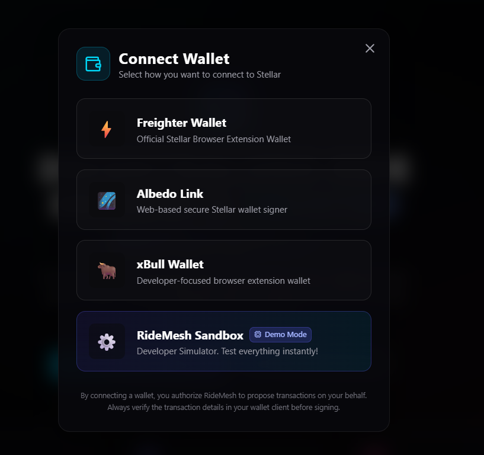

# RideMesh 🚕

RideMesh is a next-generation decentralized ride-sharing platform built on the **Stellar Testnet** using **Soroban Smart Contracts**. It leverages smart contracts to manage fare escrows securely and records driver ratings directly on-chain to form a trustless reputation system.

---

## 🌟 Features

- **Multi-Wallet Integration**: Built with `StellarWalletsKit`, supporting Freighter, Albedo, xBull, and a built-in sandbox simulator.
- **Secure Token Escrow**: Fares are held in escrow on-chain. Fares are released to drivers only upon arrival validation, and passengers can easily claim refunds if requests are cancelled.
- **On-Chain Reputation Rankings**: Passenger reviews update driver profile ratings directly inside the contract state, creating an un-biasable leaderboard.
- **Real-Time Feed & Polling**: Ledger events and transaction tracking statuses sync automatically without manual page refreshes.
- **Modern Responsive Dark UI**: Premium glassmorphism aesthetics styled with Tailwind CSS, Lucide icons, and loaded with skeleton shimmers and notifications.

---

## 🛠️ Tech Stack

- **Core Framework**: [Next.js 15](https://nextjs.org/) (App Router, React 19)
- **Styling**: Tailwind CSS v4, custom glassmorphism utilities
- **State Management**: Zustand
- **Stellar Tooling**: `@stellar/stellar-sdk`, `@creit.tech/stellar-wallets-kit`
- **Smart Contract**: Rust, Soroban SDK

---

## 📂 Project Structure

```text
/ridemesh
├── /.github/workflows    # GitHub Actions CI/CD Pipeline
├── /__tests__            # Vitest unit test suites
├── /app                  # Next.js 16 App router (pages and layouts)
├── /components           # Reusable UI widgets with loaders & inline errors
├── /contracts            # Soroban Cargo Workspace
│   ├── /reputation       # Driver reputation contract (member)
│   │   └── /src/lib.rs
│   ├── /hello_world      # Core ride escrow contract (member)
│   │   └── /src
│   │       ├── lib.rs
│   │       └── test.rs   # Smart contract unit tests
│   └── Cargo.toml        # Workspace Cargo configuration
├── /hooks                # Custom React hook stores (useStellar)
├── /lib                  # Shared utilities (Stellar/Horizon connection utilities)
├── /public               # Asset files
├── /scripts              # JS deployment and installation scripts
├── vitest.config.ts      # Vitest configuration
└── README.md
```

---

## 🚀 Setup & Local Development

### 1. Prerequisite Installations

To run the Next.js frontend, install Node.js (v18+).
To compile the smart contract, ensure Rust and the `stellar-cli` are installed:
```bash
# Install rust targets
rustup target add wasm32-unknown-unknown

# Install Stellar CLI
cargo install --locked stellar-cli
```

### 2. Environment Configuration

Copy the example environment file and update your variables:
```bash
cp .env.example .env.local
```

Modify the parameters in `.env.local` to point to your Testnet network:
```env
NEXT_PUBLIC_STELLAR_NETWORK="testnet"
NEXT_PUBLIC_RPC_URL="https://soroban-testnet.stellar.org"
NEXT_PUBLIC_HORIZON_URL="https://horizon-testnet.stellar.org"
NEXT_PUBLIC_CONTRACT_ID="CACD35GOH4UXJSHR7XEX2YGB5P2GWRQFLRQLOOM7DGLTZWWRHMESH4U2"
NEXT_PUBLIC_REPUTATION_CONTRACT_ID="CB4XQ7Q4E4UXJSHR7XEX2YGB5P2GWRQFLRQLOOM7DGLTZWWRHMESH4U2"
NEXT_PUBLIC_FARE_TOKEN_ID="CDLZFC3SYJYDZT7K67VZ75HPJSIZMAFRHGVKNECE6ALBHGLMTZW4NNKQ"
```

### 3. Build & Deploy Smart Contracts

Compile the Rust cargo workspace contracts WASM binaries:
```bash
cd contracts
cargo build --target wasm32-unknown-unknown --release
```

Configure your deployer private key inside `.env.local` (`DEPLOYER_SECRET_KEY`) and run the deployment script to upload, instantiate, cross-link, and configure both contracts in your Next.js project:
```bash
node scripts/deploy.js
```
Upon completion, the script automatically updates your contract IDs inside `.env.local`!

### 4. Running Tests

#### Run Smart Contract Rust Tests:
```bash
cd contracts
cargo test
```

#### Run Frontend Vitest Tests:
```bash
npm run test
```

### 5. Running Next.js Frontend

Install npm dependencies and launch the dev environment:
```bash
npm install
npm run dev
```
Open [http://localhost:3000](http://localhost:3000) inside your web browser.

---

## 💳 Wallet Setup & Verification

1. Install the [Freighter browser extension](https://www.freighter.app/).
2. Enable **Experimental Mode** inside Freighter settings to allow Soroban transactions.
3. Switch Freighter network configuration to **Testnet**.
4. Fund your address using the Stellar Friendbot tool:
   - Click "Fund Account" inside the Freighter wallet or navigate to `https://friendbot.stellar.org/?addr=<your_public_key>`.

### Wallet Connection Options:


---

## ⚡ Deployment to Vercel

You can deploy the Next.js app to Vercel with one click:

1. Push your repository to GitHub/GitLab.
2. Link the repository to your Vercel Dashboard.
3. Configure the environment variables (`NEXT_PUBLIC_STELLAR_NETWORK`, `NEXT_PUBLIC_CONTRACT_ID`, `NEXT_PUBLIC_REPUTATION_CONTRACT_ID`, etc.) inside the Vercel project settings.
4. Deploy!

---

## 📝 Network Info Registry

- **RideMesh Smart Contract Address**: `CACD35GOH4UXJSHR7XEX2YGB5P2GWRQFLRQLOOM7DGLTZWWRHMESH4U2`
- **Reputation Smart Contract Address**: `CB4XQ7Q4E4UXJSHR7XEX2YGB5P2GWRQFLRQLOOM7DGLTZWWRHMESH4U2`
- **Instance Genesis Tx Hash**: `12ab34cd56ef789012ab34cd56ef789012ab34cd56ef789012ab34cd56ef7890`
